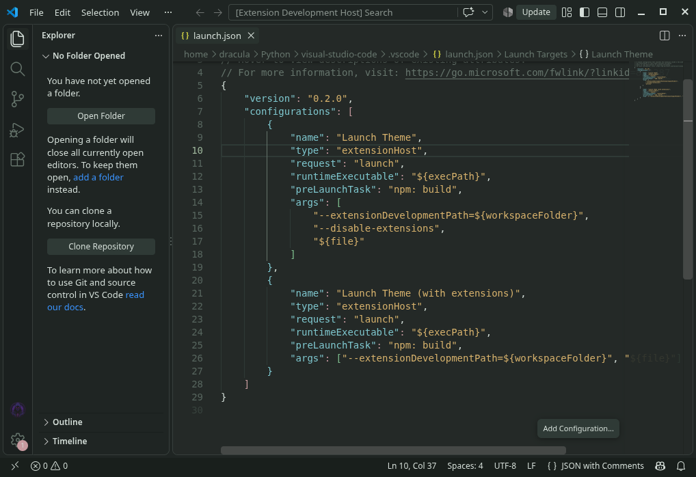
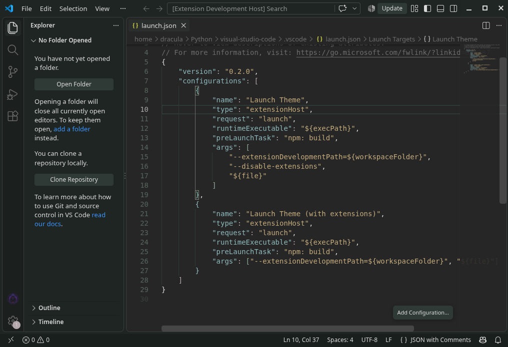

# Mirkwood for Visual Studio Code

> A forest-inspired dark and light theme for Visual Studio Code, designed for focused and comfortable coding.



Mirkwood is a carefully designed Visual Studio Code theme built around deep forest greens, muted cyan, warm earthy accents, and soft contrast.

The goal is simple: **a calm coding environment that stays readable for long sessions without relying on overly bright neon colors.**

---

## Features

* 🌲 Forest-inspired color palette
* 🌙 Dark Focus theme
* ☀️ Light Focus theme
* 🎨 Custom syntax highlighting
* 🧩 Semantic highlighting support
* 💻 Customized editor and UI colors
* 🖥️ Terminal and sidebar styling
* 📑 Custom tab and status-bar colors
* 🔤 Carefully tuned comments, keywords, functions, types, strings, and constants
* 🧘 Designed for focused, long coding sessions

---

## Preview

### Mirkwood Dark


### Mirkwood Light



---

## Color Palette

### Dark Focus

| Role              | Color     |
| ----------------- | --------- |
| Background        | `#1E2522` |
| Current Line      | `#29352F` |
| Foreground        | `#D5DFD9` |
| Comments          | `#758A7E` |
| Types / Built-ins | `#84C2C6` |
| Strings           | `#79B791` |
| Numbers           | `#DCA875` |
| Keywords          | `#CD8C95` |
| Functions         | `#93C09B` |
| Errors            | `#E07A5F` |
| Attributes        | `#E1B168` |

### Light Focus

| Role              | Color     |
| ----------------- | --------- |
| Background        | `#EBF0ED` |
| Current Line      | `#D6E0DA` |
| Foreground        | `#23332B` |
| Comments          | `#627A6C` |
| Types / Built-ins | `#2D7277` |
| Strings           | `#2E6F48` |
| Numbers           | `#935824` |
| Keywords          | `#983A48` |
| Functions         | `#3B7B53` |
| Errors            | `#B54228` |
| Attributes        | `#8F6B1E` |

---

## Installation

### Install from VSIX

Download the latest `.vsix` release and install it through Visual Studio Code.

1. Open Visual Studio Code.
2. Press `Ctrl + Shift + P`.
3. Search for:

```text
Extensions: Install from VSIX...
```

4. Select the downloaded Mirkwood `.vsix` file.
5. Reload Visual Studio Code if requested.

### Install from the Command Line

If you have downloaded the VSIX package:

```bash
code --install-extension mirkwood-theme-1.0.0.vsix
```

Replace the filename with the version you downloaded.

---

## Activate Mirkwood

After installation:

1. Open Visual Studio Code.
2. Press `Ctrl + Shift + P`.
3. Search for:

```text
Preferences: Color Theme
```

4. Select **Mirkwood**.

If the extension contains multiple variants, choose the desired Mirkwood theme from the list.

---

## Install from Source

For developers who want to work with the source code:

```bash
git clone https://github.com/Anonymous-25/vscode-mirkwood-theme.git

cd <YOUR_REPOSITORY_DIRECTORY>

npm install

npm run build
```

After building, package the extension:

```bash
npx vsce package
```

This will create a `.vsix` package that can be installed directly in Visual Studio Code.

---

## Development

Clone the repository:

```bash
git clone https://github.com/Anonymous-25/vscode-mirkwood-theme.git
cd <YOUR_REPOSITORY_DIRECTORY>
```

Install dependencies:

```bash
npm install
```

Build the theme:

```bash
npm run build
```

Package the extension:

```bash
npx vsce package
```

The generated VSIX file can then be installed locally.

---

## Theme Design

Mirkwood is built around a restrained forest-inspired palette.

The dark theme uses:

* Deep forest backgrounds
* Muted green syntax
* Soft cyan for types and built-ins
* Warm orange for numbers
* Rose tones for keywords
* Green accents for functions
* Warm yellow for attributes
* Soft red for errors

The light theme uses a corresponding lighter palette while maintaining the same visual language.

The two themes are designed to feel like different modes of the **same color system**, rather than unrelated dark and light themes.

---

## Syntax Highlighting

Mirkwood uses Visual Studio Code's TextMate grammars and semantic-token system.

Syntax highlighting can therefore vary between programming languages depending on the language grammar or extension being used.

If you encounter an unexpected token color, please check whether the behavior also occurs with another VS Code theme before reporting it as a Mirkwood issue.

See [KNOWN_ISSUES.md](./KNOWN_ISSUES.md) for more information.

---

## Known Issues

See:

[KNOWN_ISSUES.md](./KNOWN_ISSUES.md)

If you find a theme-specific problem that isn't documented there, please open an issue with:

* VS Code version
* Mirkwood version
* Operating system
* Programming language
* Relevant language extension
* Example code
* Screenshot, if applicable

---

## Contributing

Contributions, bug reports, suggestions, and improvements are welcome.

Before submitting a change:

1. Fork the repository.
2. Create a new branch.
3. Make your changes.
4. Test the theme in Visual Studio Code.
5. Build the extension successfully.
6. Submit a pull request.

For larger changes, consider opening an issue first to discuss the idea.

---

## Credits

Mirkwood was developed as an independent theme with its own color palette, visual identity, and design direction.

The project may build upon ideas and technical concepts from the broader Visual Studio Code theme ecosystem and open-source community.

All third-party components or source material used by the project remain subject to their respective licenses.

---

## Community

For questions, suggestions, bug reports, and development discussions, use the project's GitHub repository and issue tracker.

* **Issues:** Report bugs and theme problems
* **Discussions:** Share ideas and suggestions
* **Pull Requests:** Contribute improvements

---

## Roadmap

Possible future improvements include:

* Additional syntax refinements
* More language-specific highlighting adjustments
* Improved semantic-token support
* Additional theme variants
* Further UI color refinements
* Better accessibility and contrast tuning

---

## License

Mirkwood is released under the [MIT License](./LICENSE).

---

<p align="center">

**Mirkwood**

*A quiet forest for your code.*

</p>
